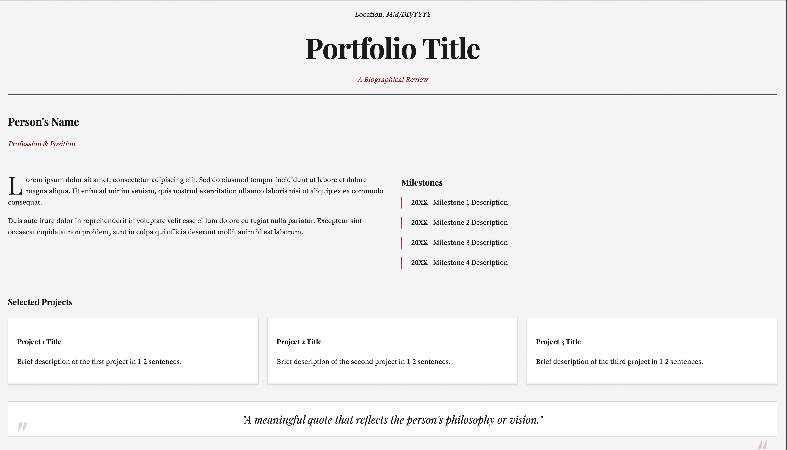

# Newspaper-Style Portfolio Template 🖥️

A responsive, newspaper-inspired portfolio template with a vintage design, built with HTML, CSS, and vanilla JavaScript. Perfect for personal portfolios, CVs, or professional presentations.

## 🖼️ Preview



## ✨ Features

- 📰 Classic newspaper-inspired design
- 🖼️ Responsive layout
- 📱 Mobile-friendly
- ✨ Smooth animations
- 🔍 Modal project views
- 📝 Contact form
- ⌨️ Keyboard navigation support
- 🎨 Customizable color scheme

## Getting Started

### Prerequisites

- A modern web browser
- Basic knowledge of HTML and CSS for customization

### Installation

1. Clone the repository:
   ```bash
   git clone https://github.com/friedrich-x/newspaper-portfolio.git
   ```

2. Open `index.html` in your browser to view the template.

## 🛠️ Customization

1. **Colors**: Edit the CSS variables in `styles.css`:
   ```css
   :root {
       --primary-color: #1a1a1a;
       --accent-color: #8b0000;
       --background-color: #f5f5f5;
   }
   ```

2. **Content**: Replace the placeholder content in `index.html` with your own:
   - Update personal information
   - Add your projects
   - Modify contact details
   - Change images and text

3. **Fonts**: The template uses Google Fonts. To change them:
   - Update the Google Fonts link in the HTML head
   - Modify the font-family properties in CSS

## Structure
```
newspaper-portfolio/
├── index.html       # Main HTML file
├── styles.css       # Stylesheet
├── preview.png     # Preview image
└── README.md        # Documentation
```

## Features in Detail

### Modal Windows
- Click on projects to view detailed information
- Close with 'X', ESC key, or clicking outside
- Smooth animations

### Responsive Design
- Mobile-first approach
- Flexible grid system
- Adaptive typography

### Animations
- Smooth page load animations
- Interactive hover effects
- Transition effects

## 🌐 Browser Support

- Chrome (latest)
- Firefox (latest)
- Safari (latest)
- Edge (latest)

## 📜 License

This project is open source and available under the MIT License - see the [LICENSE](LICENSE) file for details.

## Acknowledgments

- Fonts: [Google Fonts](https://fonts.google.com/)
- Inspiration: Classic newspaper layouts
- Icons: Default HTML/CSS elements

## Support

If you have any questions or need help customizing the template, please open an issue in the repository.

---

**Made with ❤️ by 3xpl0its**